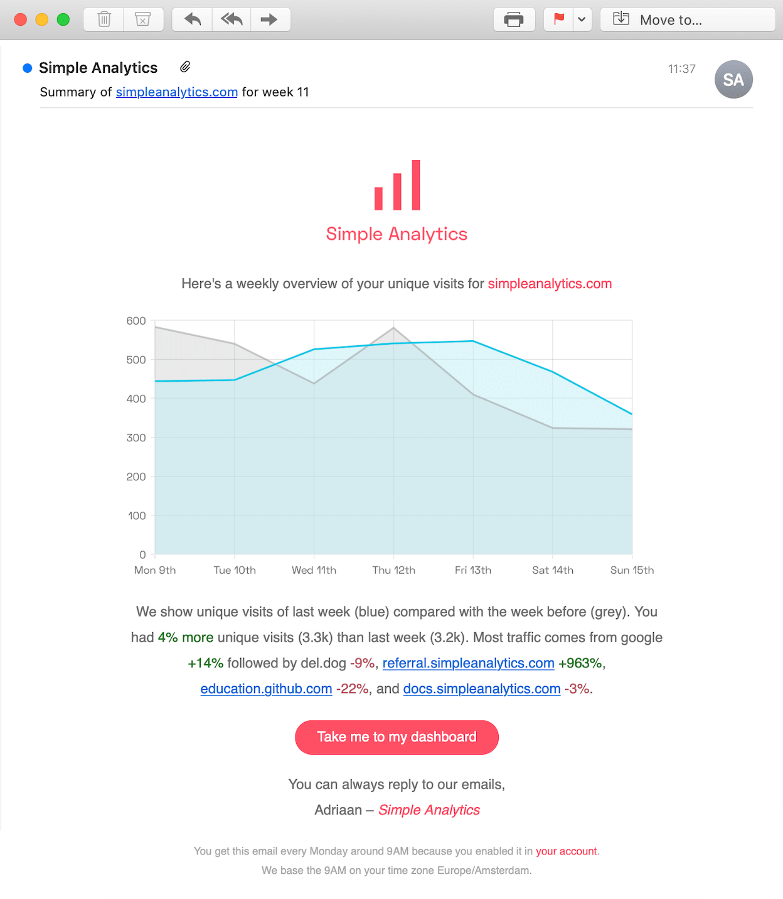

Sometimes you don't have time to check the dashboard. Therefore you might miss a certain spike of traffic. That's why we created email reports. Do you want a monthly or weekly report of your website? Just enable it in [your account settings](https://simpleanalytics.com/account).

> We are thinking of a feature where you can send these reports directly to your clients.

The email will look more or less like this:

It includes the top 5 referrers and we compare them with the previous period. This gives you a indication of where your website is getting its traffic from, and how those numbers might have changed.

In the example above it shows that we got significantly more traffic from our referral website _(referral.simpleanalytics.com +963%)_ than last week. Time for us to find out why. Thanks email report :)

We send this email at 9AM in your local time zone. You can change this time zone per website in your website settings.
