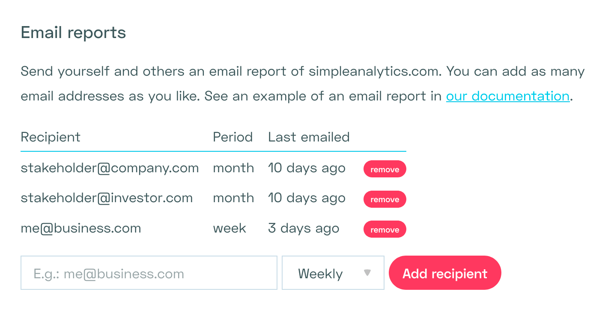

Want to start your Monday morning by checking how your website is doing? Want to send updates to others? Use our weekly or monthly email reports so you don't have to check the dashboard all the time. Never miss that spike of traffic.

Just enable it in [your website settings](https://simpleanalytics.com/select-website/settings#email-reports). Look for the section that looks like this:

The email will look more or less like this:

It includes the top 5 referrers and we compare them with the previous period. This gives you a indication of where your website is getting its traffic from, and how those numbers might have changed.

In the example above it shows that we got significantly more traffic from our referral website _(referral.simpleanalytics.com +963%)_ than last week. Time for us to find out why. Thanks email report :)

We send this email at 9AM in your local time zone. You can change this time zone per website in your [website settings](https://simpleanalytics.com/select-website/settings#timezone).
